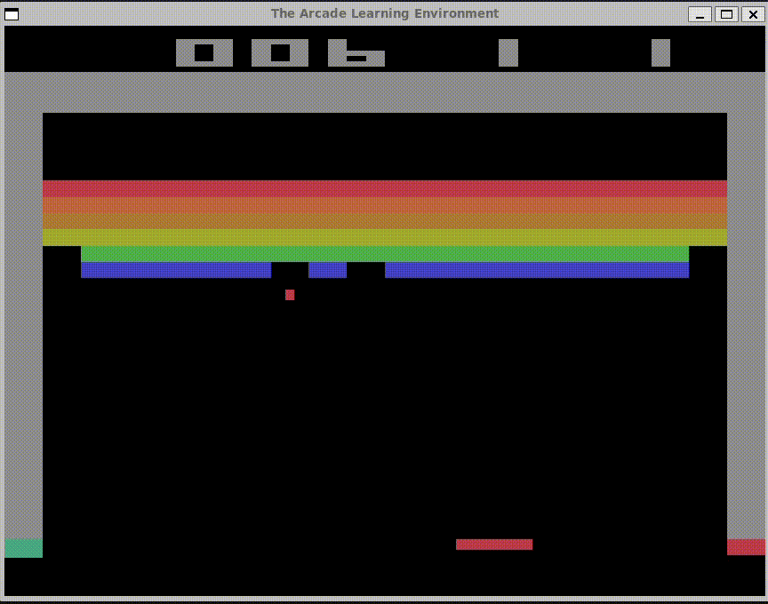

## deeplearning final assignment
this is the instruction of how to use ALE environment and gymnasium.
please follow the procedure below.

### Gameplay Preview



### environment

- python 3.10
- wsl

---
### 1. Install gymnasium and ALE dependencies

```bash
pip install "gymnasium[atari]"
```

```bash
pip install ale-py
```
see the link of ale:
https://ale.farama.org/getting-started/


### 2.Install AutoROM to download Atari ROMs
next, you need to install AutoROM

```bash
pip install autorom
```


in my case, I needed to clarify the path:
```bash
mkdir ~/.local/share/gymnasium/roms
python3 -m autorom --accept-license --install-dir ~/.local/share/gymnasium/roms
```

or simply (if default path is fine)
```bash
AutoROM --accept-license
```

### 3. run the game

```bash
python play_human.py
```

- ←: Move left
- →: Move right
- Space: Fire (start the game)
- Close window to exit


## 📄 Licenses of Dependencies

This project uses the following open-source libraries:

| Library       | License         | Link                                 |
|---------------|------------------|--------------------------------------|
| gymnasium     | MIT              | https://github.com/Farama-Foundation/Gymnasium/blob/main/LICENSE |
| ale-py        | BSD-2-Clause     | https://github.com/Farama-Foundation/ALE-py/blob/main/LICENSE      |
| pygame        | LGPL             | https://www.pygame.org/license.html                                 |
| numpy         | BSD              | https://numpy.org/doc/stable/license.html                           |

Please refer to the linked license files for more details.
